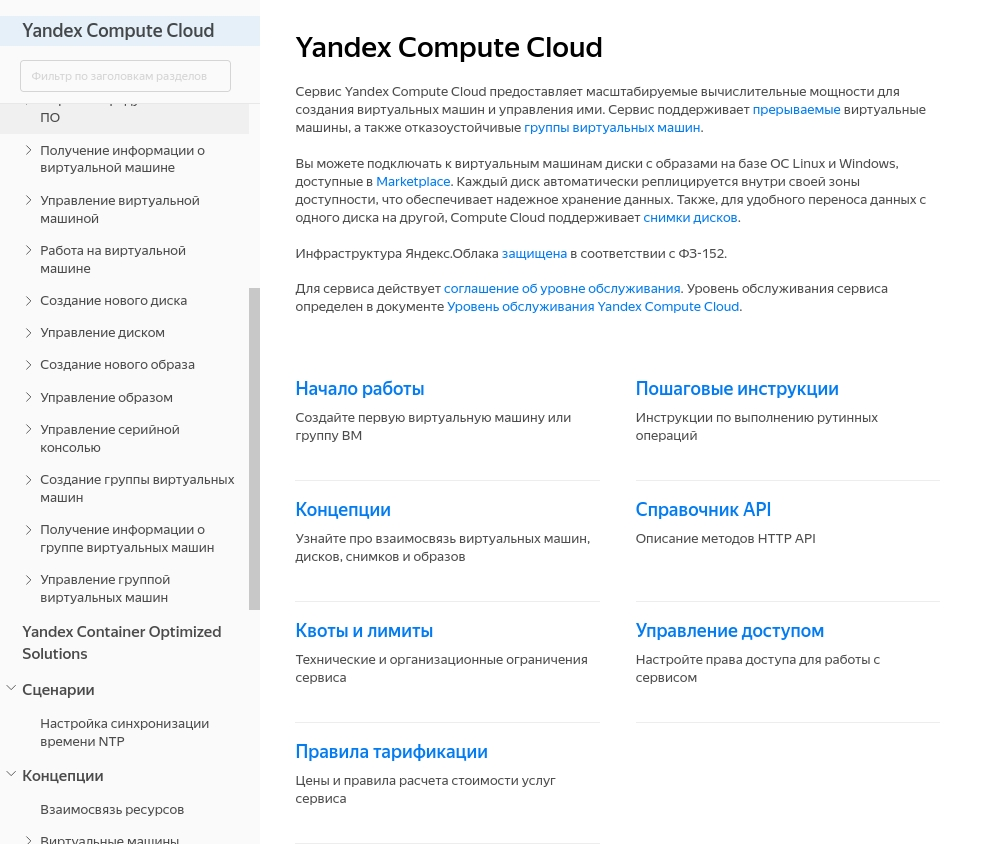

# Структура YFM проекта

## Содержание

- [Пример структуры проекта](#example)
- [Оглавление раздела](#toc)
    - [Условия видимости разделов](#tocWhen)
    - [Вставки оглавлений](#tocIncludes)
- [Файлы пресетов](#presets)
- [Разводящая страница](#page)
- [Файл конфигурации](#config)

## Пример структуры проекта <a name="example"></a>

В качестве максимально полного примера YFM проекта можно смотреть исходники [документации Яндекс.Облака](https://github.com/yandex-cloud/docs).

```
input-folder
|-- .yfm (Файл конфигурации YFM)
|-- toc.yaml (Файл навигации)
|-- presets.yaml (Набор пресетов с переменными)
|-- index.yaml (Разводящая страница документации)
|-- quickstart.md (Файлы документации и изображения)
|-- pages
    |-- faq.md
    |-- how-to.md
|-- assets
    |-- image1.png
    |-- image2.png
|-- includes
    |-- faq_shared_block.md
```

## Оглавление раздела <a name="toc"></a>

Навигация раздела описывается специальным `toc.yaml` файлом. В сборку проекта попадают только указанные в нем файлы.

### Пример

```yaml
title: Yandex Cloud Marketplace
href: index.yaml
items:
  - name: Тестовый топикхед
    items:
      - name: Создание виртуальной машины
        href: create.md
  - name: Первичная настройка программного обеспечения
    href: setup.md
  - name: Работа с виртуальной машиной
    href: operate.md
    when: version == 12
  - name: Справочник API
    include:
      repo: docs-api
      path: api-ref/toc.yaml
```

### Свойства элемента навигации

Каждый элемент навигации может иметь следующие свойства:

- `name`

    Текст в меню навигации.

- `href`

    Относительный путь до файла с YFM контентом.

- `items`

    Оглавление подраздела.

- `when`

    Условие видимости (подробнее ниже).

- `include`

    Вставка другого оглавления (подрбнее ниже).

### Условия видимости разделов <a name="tocWhen"></a>

Вы можете скрывать разделы с помощью переданных переменных. Условие видимости описывается в параметре `when`:

```when: version == 12```

Например, некоторые разделы, могут быть актуальны только для определенных версий сервиса.

### Вставки оглавлений <a name="tocIncludes"></a>

Можно включить в оглавление другое оглавление. Для этого в элементе нужно указать поле `include` с указанием пути `path`
до включаемого оглавления `toc.yaml`. Это удобно, например, когда у вас есть раздел со словарями, автоматически сгенеренный
по коду или proto-спецификациям, и вы хотите использовать его части в разных местах документации.

## Файлы пресетов <a name="presets"></a>

Набор значений [YFM переменных](https://github.com/yandex-cloud/yfm-transform/blob/master/DOCS.md#vars) можно описать в
специальных файлах пресетов: `presets.yaml`.

Каждый файл пресетов должен содержать секцию `default`.

При вычислении переменных берутся значения из секции `default` и из секции указанной в параметре `varsPreset`,
с приоритетом последней.

Пресеты удобны, например, если вы собираете документацию в двух режимах: внутренней и внешней. Не нужно хранить значения
переменных в скриптах сборки. Создаете пресет с двумя секциями internal/external и переменные остаются в
документационном проекте, а в скриптах только указание имени пресета.

Файлов пресетов может быть сколько угодно. Они будут накладываться в порядке уменьшения приоритета: от ближайшего
к конвертируемому сейчас файлу к самому близкому к корню проекта. Но мы рекомендуем ограничится максимально
верхнеуровневыми пресетами.

Пример `presets.yaml`

```
default:
    position: Волшебник
internal:
    place: Изумрудный город
external:
    place: Страна Оз
```

## Разводящая страница <a name="page"></a>

Для быстрой навигации по разделу, часто удобно сделать первый экран в разделе не обзорным текстом, а набором ссылок на
основные разделы. Yfm-docs позволяет сделать их не просто ссылками, а удобными для клика плитками.



Пример файла:

```yaml
# Заголовок и описание
title: "Биллинг в облаке"
description: "Биллинг — это сервис в составе Яндекс.Облака, который позволяет получать информацию о количестве потребленных ресурсов, проверять расходы денежных средств и оплачивать ресурсы. В Яндекс.Облаке вы платите только за потребленные ресурсы и только за время их фактического использования."
# Мета-информация title, description, keywords и т.п. (title вкладки и разные SEO-теги)
meta:
  title: "Биллинг в облаке"
# Блок с ссылками
links:
- title: "Начало работы"
  description: "Как создать свою первую виртуальную машину"
  href: "#"
- title: "Базовые операции"
  description: "Пошаговые инструкции по операциям настройки, подключения, изменения"
  href: "#"
```

## Файл конфигурации <a name="config"></a>

Опционально, проект может содержать файл настроек.

По-умолчанию, используется файл `.yfm` в корне проекта.

Имя | Описание | Тип | Значение по-умолчанию
:--- | :--- | :--- | :---
allowHTML | Разрешено ли использование HTML | bool | false
varsPreset | Имя используемого пресета | string | 'default'
strict | Допустимы ли предупреждения в логах yfm-transform | bool | false
ignore | Список файлов исключаемые из сборки | [] | undefined
vars | Переменные | {} | undefined

```yaml
allowHTML: true
strict: true
varsPreset: "default"
ignore:
    "**/includes/*.md"
```
